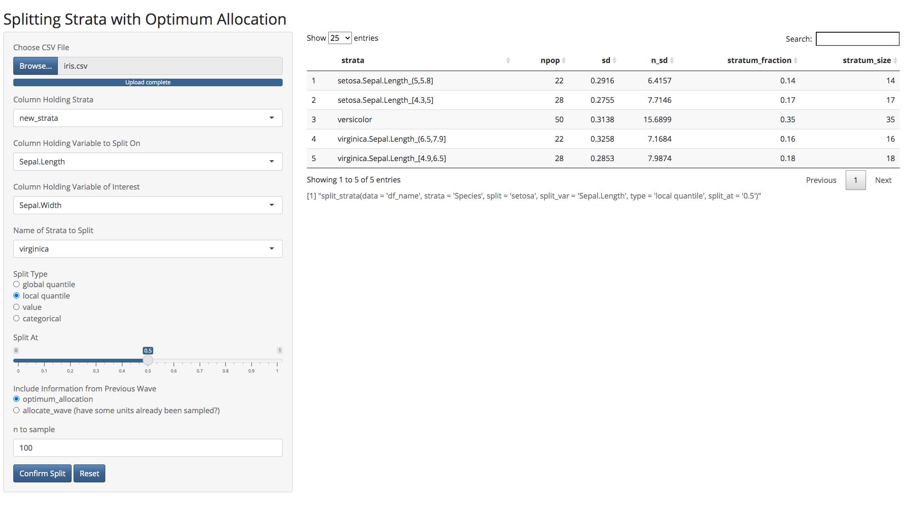

<!-- README.md is generated from README.Rmd. Please edit that file -->

# optimall

`optimall` offers a collection of functions that are designed to
streamline the process of optimum sample allocation, specifically under
an adaptive, multi-wave approach. Its main functions allow users to:

  - Define, split, and merge strata based on values or quantiles of
    other variables.

  - Calculate the optimum number of samples to allocate to each stratum
    in a given study in order to minimize the variance of an estimate of
    interest.

  - Select specific ids to sample based on a stratified sampling design.

  - Optimally allocate a fixed number of samples to an ancillary
    sampling wave based on results from a prior wave.

When used together, these functions can automate most of the sampling
workflow.

## Installation

You can install the development version of `optimall` from
[GitHub](https://github.com/) with:

``` r
# install.packages("devtools")
devtools::install_github("yangjasp/optimall")
```

## Example

Given a dataframe where each row represents one unit, `optimall` can
define the stratum each unit belongs to:

``` r
library(optimall)
data <- split_strata(data = data, strata = "old_strata", 
                     split_var = "variable_to_split_on", 
                     type = "value", split_at = c(1,2))
```

If the strata or values to split at are not obvious, it may be useful to
try a few different splits and observe the effects that each has on
sample allocation. `optimall` makes this process quick and easy with a
Shiny app that can be launched with `optimall_shiny`. This app allows
users to adjust inputs to the `split_strata` function and view the
results in real time. Once the parameters are satisfactory, the user can
confirm the split and move on to further ones if desired. The app prints
the code required to replicate the splits in `optimall`, so making the
changes inside of R becomes as easy as a copy and paste\!

<b>Screenshot:</b>



We can then use `optimum_allocation` to calculate the optimum allocation
a fixed number of samples to our strata in order to minimize the
variance of a variable of interest.

``` r
optimum_allocation(data = data, strata = "new_strata", 
                   y = "var_of_interest", nsample = 100)
```

`optimall` offers more functions that streamline adaptive, multi-wave
sampling workflows. For a more detailed description, see package
vignettes.

## References

> McIsaac MA, Cook RJ. Adaptive sampling in two‐phase designs: a
> biomarker study for progression in arthritis. Statistics in Medicine.
> 2015 Sep 20;34(21):2899-912.

> Wright, T. (2014). A simple method of exact optimal sample allocation
> under stratification with any mixed constraint patterns. Statistics,
> 07.
