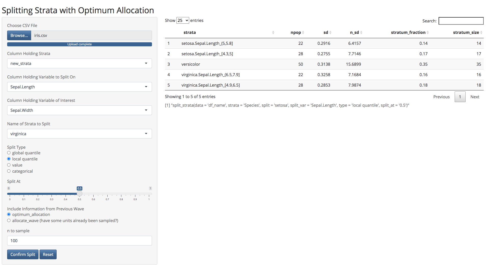

```{r, include = FALSE}
knitr::opts_chunk$set(
  collapse = TRUE,
  comment = "#>"
)
```

```{r setup, include = F}
library(optimall)
```

## Introduction

The function `optimall_shiny()`, located within the package `optimall`, launches a Shiny app that allows users to observe how the stratum sizes, standard deviations, and optimum allocations react to different stratum splits. This vignette demonstrates how to use the application.

## Uploading Data

The first step in using `optimall_shiny()` is uploading data. The data must be in the same format that the rest of `optimall`'s functions require, meaning that each row must corresponds to one sampling unit. If you have already updated an existing dataset in your R workflow, you will have to save the updated dataframe to a .csv file in order to work with it in `optimall_shiny()`.

<center>
<br />
{width=80%}
</center>
<br />

## Splitting Strata

Once the dataset has been uploaded, options for the user to select inputs will appear. Each input correspond to an argument of at least one function in `optimall`, and the application provides a list of valid options for each one based on the uploaded data. See them below:

* **Column Holding Strata** corresponds to the `strata` argument in `split_strata()`. The dropdown menu includes a list of column names from which the user should choose the name of the column that defines the stratum that each unit belongs to.

* **Column Holding Variable to Split On** corresponds to the `split_var` argument in `split_strata()`. The dropdown menu includes a list of column names from which the user should choose the name of the column that holds the variable (continuous or categorical) that will be used to split strata on.

* **Column Holding Variable of Interest** corresponds to the `y` argument in `optimum_allocation()` or `allocate_wave()`. The dropdown menu again includes a list of column names from which the user should choose the column holding the variable of interest. Since the application displays, it needs to know this variable of interest, `y`, in order to calculate the optimum allocation.

* **Name of Strata to Split** corresponds to the `split` argument in `split_strata()`. The dropdown menu includes a list of the unique stratum names from the column holding strata. Although the package allows for multiple strata to be selected in the same call, the Shiny application currently supports only one (or all) strata to be split at once. 

* **Split Type** corresponds to the `split_type` argument in `split_strata()`. If the variable to split on is not numeric, the type must be categorical. For more details on each option, see the documentation at `?split_strata`. 

* **Split At** corresponds to the `split_at` argument in `split_strata()`. If the split type is one of global quantile, local quantile, or value, this input will be a slider for the user to adjust the exact split location. If the split type is categorical, this input will contain boxes for each unique value of the `split_var`. In the  categorical case, the checked boxes will be interpreted as category 1, while the unchecked boxes will be category 0. 

* **Include Information from Previous Wave**  allows users to select if the displayed dataframe should be output from `optimum_allocation()` or `allocate_wave()`. If `optimum_allocation()` is chosen, it defaults to the "WrightII" method with `allow.na = TRUE`. If `allocate_wave()` is chosen, a new option to to select which column contains the prior wave indicator will appear, and a valid column (containing 0/1 or Y/N) must be selected. This choice corresponds to the `wave2a` argument of `allocate_wave()`. 

* **n to sample** allows users to indicate the number of samples to be taken for the output dataframe. This selection corresponds to the `nsample` argument of either `optimum_allocation()` or `allocate_wave()`. Thus, it should be different depending on which allocation function was selected. For `optimum_allocation()`, it should be the total number of samples to be taken, while for `allocate_wave()`, it only indicates how many samples should be taken in the *current wave*. 

## Output

`optimall_shiny()` displays the output dataframe of `optimum_allocation()` or `allocate_wave()` based on the current inputs. After a split is confirmed and these inputs are reset, it will show an error in place of this dataframe until valid inputs are selected again. Displayed below this dataframe is a text list of the code that performs each of the confirmed splits in `optimall`.

<center>
<br />
{width=98%}
</center>
<br />

## Confirming Splits

When the user is satisfied with the parameters that are selected, a split can be confirmed by pressing the `Confirm Split` button at the bottom left of the page. This will split the existing data using the `split_strata()` parameters specified in the inputs. The inputs that specify arguments for the allocation will not change the splits, they are only included to show how each split may impact the sample allocation.

After `Confirm Split` is pressed, the code to perform that split will appear in the output at the bottom right of the page. The updated strata will now be in a column called "new_strata", and the inputs will reset. Using "new_strata" as the column defining the strata, the user can then perform more splits, and the code to perform each one will be added to the list at the bottom right with each confirmation.

## Implementing Splits in R

The splits in `optimall_shiny()` will not be performed on the true dataset in the user's `optimall` workflow in R. Instead, the user must return to R if they want to actually transform the data into a working dataframe with the new strata. The code displayed in the app's output makes this task simple, as it can be copied and pasted into an R script to replicate the splits conducted in the app. Note, however, that the `data` argument in each `split_strata()` call needs to be changed to reflect the user's name for the data. 

## Error Messages

If any of the selected inputs results in an error in either `split_strata()` or the selected allocation function, the app will print the error. 
