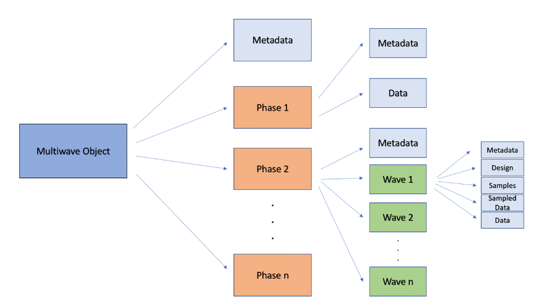
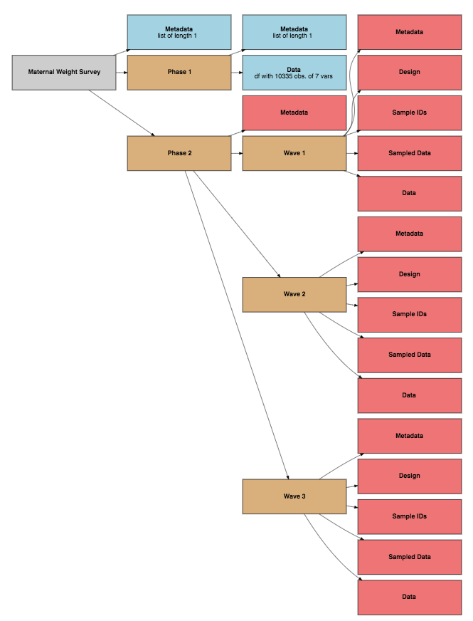
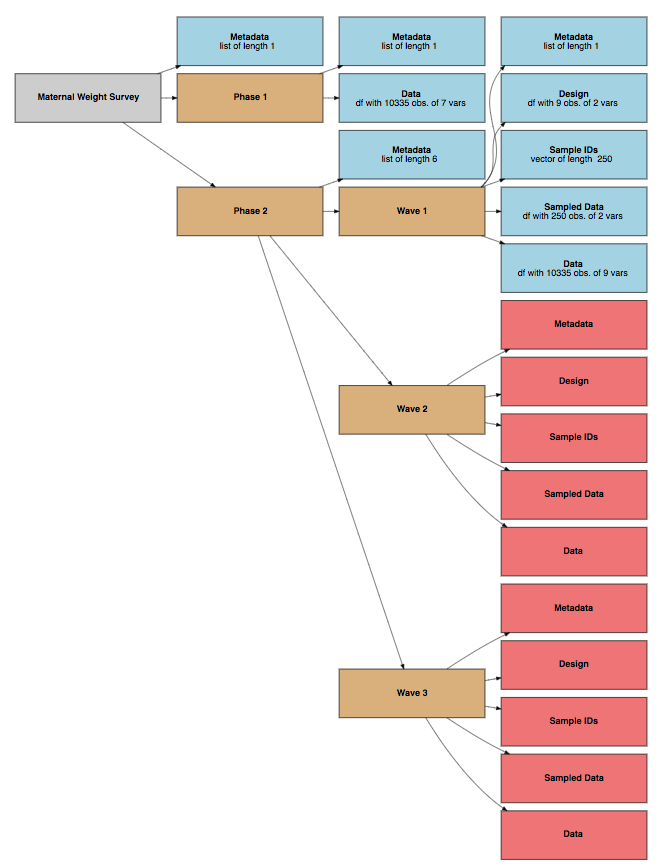

```{r setup, include=FALSE}
knitr::opts_chunk$set(
  collapse = TRUE,
  comment = "#>"
)

#packages
library(optimall)
library(DiagrammeR)
library(dplyr)

#data
data(MatWgt_Sim, package = "optimall")
MatWgt_Sim <- MatWgt_Sim %>%
  dplyr::mutate(race = 
                  dplyr::case_when(race == "Asian" ~ "Other",
                                   race == "Other" ~ "Other",
                                   race == "White" ~ "White",
                                   race == "Black" ~ "Black"))
phase1 <- dplyr::select(MatWgt_Sim, -mat_weight_true)

phase1$strata <- phase1$race #initialize a strata column first
set.seed(452)
phase1 <- split_strata(data = phase1, strata = "strata", split = NULL, 
                       split_var = "mat_weight_est", 
                       type = "global quantile", 
                       split_at = c(0.25,0.75),
                       trunc = "MWC_est")
#Trunc argument specifies how to refer to mat_weight_est in new strata names

#Make Phase 1 data dict
phase1_data_dictionary <- data.frame("Variable" = c("id",
                                                    "race",
                                                    "mat_weight_est",
                                                    "diabetes"),
                                     "Description" = c("unique identifier",
                                                       "race of mother",
                                                       "error-prone estimate of maternal weight change during pregnancy",
                                                       "1/0 indicator for diabetes in the mother during pregnancy"))
```

## Overview

The base functions of `optimall` allow users to efficiently determine optimum allocation, select samples, and split strata during the design of a multi-wave stratified sampling survey. Despite these features, an efficient sampling workflow in R still requires the user to manually organize the many moving parts of the process including design data, a list of samples, data extracted from the samples, and merged data for each wave. When a sampling design involves many waves, these parts can be difficult to keep track of and may be prone to errors. Even more, it may be difficult to go back and reproduce results at the end of a long sampling process.

This vignette describes an addition to `optimall` called the multiwave object, which stores the metadata, design, samples, and merged data from each step of the multi-wave sampling process in an accessible format. It is optional for the user to use, but it offers the advantages of automatic organization, efficient compatibility with other functions in `optimall`, and an option for a summary of the sampling design to be printed at any point. It is recommended that user thoroughly reads the introductory package vignette titled "Using Optimall" before reading this vignette.

This addition contributes towards `optimall's` goal of being a tool to streamline the often cumbersome aspects of the multi-wave sampling workflow.

## Format

The multiwave object uses the S4 class system, which makes it slightly more complicated to work with in R. Fortunately, all of these potential complications are dealt with in the package design and will be unseen by the user. Here is what the user will see:

<center>
<br />
{width=65%}
</center>
<br />

The multiwave object contains three S4 classes:

* **Wave:** The Wave class (green in figure above) holds the metadata, design, samples, sampled data, and data for a single wave in multi-wave sampling. 

* **Phase:** The Phase class (orange in figure above) holds the metadata and a list of Wave objects for each phase.

* **Multiwave:** The Multiwave class (dark blue in figure above) contains the metadata and a list of Phase objects. It holds the entire sampling design and is the class that the user will interact with the most.

The light blue objects in the figure above represent the slots that hold the survey information directly:

* **Metadata:** The metadata slot holds an initially empty list. Relevant information can be added as named elements, including titles, data dictionaries, and arguments for `optimall` functions.

*  **Design:** The design slot holds the data frame specifying the sampling design of the current wave. In order for it to be used with `sample_strata()`, it must contain at least one column holding the strata names and one column holding the number of samples to be selected from each strata. It is typically the output of `optimum_allocation()` or `allocate_wave()`.

*  **Samples:** The samples slot contains a character vector of the sample ids that were selected in a specific wave.

* **Sampled Data:** The sampled data slot contains a data frame holding the data collected in a specific wave.

* **Data:** The data slot contains a data frame with the full data as it gets updated for each wave (or phase for phase 1). It is typically the sampled data merged with the (full) data of the previous wave. In this way, the data in the data slot of a study's ultimate sampling wave is the full study data that can be used for analysis with the `survey` package. 

## Getting Started  with the Multiwave Object

To work with the multiwave object, users only need to know a few functions. This section describes how to initialize an object, how to access and write slots of it, and how to deploy some of its useful features. This will be demonstrated in the context of the same two-phase, multiwave sampling design used in the package vignette.

A multiwave object is initialized by the function `new_multiwave()`:

```{r}
MySurvey <- new_multiwave(phases = 2, waves = c(1,3))
```

We now have an object that can hold all of the information for our two-phase survey for which the second phase will be conducted over three waves. Note that the length of the ‘waves‘ argument must match the number of phases. Phase 1 will almost always have one wave.

### Access and Write slots
As is standard for an S4 object in R, components of the multiwave object are stored in slots. To access and write slots of the multiwave object, the user could use `@` and `$`:

```{r}
#To access overall metadata
MySurvey@metadata

#To write overall metadata. We may want to include a title.
MySurvey@metadata <- list(title = "Maternal Weight Survey")

#To access Phase 2 metadata
MySurvey@phases$phase2@metadata

#To access Phase 2, Wave 2 design
MySurvey@phases$phase2@waves$wave2@design
```

but this is overly complicated and potentially unstable. Instead, any slot of the multiwave object can be accessed or written using the function `get_data()`:

```{r}
#To access overall metadata
get_data(MySurvey, phase = NA, slot = "metadata")

#To write overall metadata
get_data(MySurvey, phase = NA, slot = "metadata") <- list(title = "Maternal Weight Survey")

#To access Phase 2 metadata
get_data(MySurvey, phase = 2, slot = "metadata")

#To access Phase 2, Wave 2 design
get_data(MySurvey, phase = 2, wave = 2, slot = "design")
```

Note that calls to get data from phase 1 do not require `wave` to be specified, since phase 1 only consists of one wave.

Let's suppose that our phase 1 data has been collected. We can add it to the phase 1 data slot of our object and include any relevant metadata:

```{r}
head(phase1)

get_data(MySurvey, phase = 1, slot = "data") <- phase1

#Make Phase 1 data dict
phase1_data_dictionary <- data.frame(
  "Variable" = c( "id", "race", "mat_weight_est", "diabetes", "obesity"),
  "Description" = c("unique identifier", 
                    "race of mother",
                    "error-prone estimate of maternal weight change 
                    during pregnancy",
                    "1/0 indicator for diabetes in the mother during 
                    pregnancy",
                    "1/0 indicator for childhood obesity in child"))

head(phase1_data_dictionary)

get_data(MySurvey, phase = 1, slot = "metadata") <- list(data_dict = phase1_data_dictionary)
```

### View Summary Diagram of Survey

At any point during the multi-wave sampling workflow, `optimall` allows users to view a diagram of the structure of their survey with `multiwave_diagram()`:

```{r, eval = FALSE}
multiwave_diagram(MySurvey)
```
<center>
```{r, fig.align='center', fig.height = 5.5, fig.width = 5.5, echo= FALSE, eval = FALSE}
multiwave_diagram(MySurvey)
```

{width=55%}

</center>
Notice that the title of the survey, "Maternal Weight Survey", was found from the overall survey metadata and that boxes are colored based on whether they have been filled yet. Slots that have been filled are blue and contain a short description of their contents. This function enables users to track their progress during a multiwave sampling survey.

### Call `optimall` functions with fewer arguments
Another advantage of the multiwave object is that the primary functions of `optimall` such as `optimum_allocation()`, `allocate_wave()`, and `sample_strata()` can be called on the object using the function `apply_multiwave()`, The `apply_multiwave()` function takes the standard arguments to the function as well as `phase` and `wave`, which are used to determine the input dataframe(s) and the slot of the object where the output should be placed. If the arguments, including names of columns (which tend to be repetitive when used without the multiwave object framework), are specified in the metadata, the function will find them itself, allowing calls to the function to be much simpler. It is recommended that users gain familiarity with the basic uses of these functions on dataframes before using them on multiwave objects.

When working with a multiwave object, a new function called `merge_samples()` also becomes available. This allows users to quickly and efficiently merge the `sampled data` with the previous wave's `data`.

To demonstrate, we return to the example of sampling sepal width from the iris dataset with an adaptive, multi-wave design. Suppose that we have collected data on sepal length, petal width, and petal length for all 150 iris plants in phase 1, but we have not yet collected any of the ”expensive” sepal width variable. We can start by placing the data in the appropriate slot of our multiwave object:

```{r}

# Initialize Multiwave
IrisSurvey <- new_multiwave(phases = 2, waves = c(1,3))

# Add id column to iris dataset
iris <- cbind(datasets::iris, id = 1:150)

# To place iris data in Phase 1
get_data(IrisSurvey, phase = 1, slot = "data") <-
    subset(iris, select = -Sepal.Width)
```

Now we want to begin our first wave of sampling sepal width in phase 2. Since we expect that sepal length is correlated with our variable of interest, we decide to x-allocate the first wave of samples using integer-valued Neyman allocation on the inexpensive sepal length variable. Since we are working in the multiwave object framework, we can use `apply_multiwave()` to apply the `optimum_allocation()` function:

```{r}
IrisSurvey <- apply_multiwave(IrisSurvey, phase = 2, wave = 1,
                            fun = "optimum_allocation",
                            strata = "Species", y = "Sepal.Length",
                            nsample = 30, method = "WrightII")
```
Since `"strata"` will be `"Species"` for every wave, we may instead move that argument to the phase metadata so that we don’t have to repetitively specify the same argument in every function call:

```{r}
get_data(IrisSurvey, phase = 2, slot = "metadata") <-
  list(strata = "Species")
```

Now we no longer have to specify `strata` in the function call:

```{r}
IrisSurvey <- apply_multiwave(IrisSurvey, phase = 2, wave = 1,
                            fun = "optimum_allocation",
                            y = "Sepal.Length",
                            nsample = 30, method = "WrightII")
```

In the absence of a specific strata argument, apply_multiwave() turns to the wave, phase, and then overall metadata to look for the missing argument. In this case, it finds `strata = "Species"` in the phase metadata. By specifying the `phase` and `wave` in the function call, we are telling optimum_allocation() to use the most recent version of the data (the full data from the previous wave, or in this case, the phase 1 data) as input and to output the results in the corresponding slot of the specified wave. As such, both calls to `apply_multiwave()` output an updated multiwave object with the results of `optimum_allocation()` in the phase 2, wave 1 `"design"` slot:

```{r}
get_data(IrisSurvey, phase = 2, wave = 1, slot = "design")
```

The `allocate_wave()` function can be applied to multiwave objects in the same manner and will be demonstrated in the following examples section. After these functions have been used to specify a ”design” data frame (or a manually created design data frame has been placed in the ”design” slot to implement a different allocation strategy), we can use `apply_multiwave()` to apply `sample_strata()` and select the ids to sample for the given sampling wave:

```{r}
IrisSurvey <- apply_multiwave(IrisSurvey, phase = 2, wave = 1,
                            fun = "sample_strata", id = "id",
                            design_strata = "strata",
                            n_allocated = "stratum_size")
```

Note that we did not have to specify the `data` or `design_data` as we do in the standard version of `split_strata()` because they are extracted using the `phase` and `wave` arguments. We also did not have to specify the `strata` argument again because it was available in the phase metadata. The result of this call to `apply_multiwave()` is an updated `IrisSurvey` with a character vector of ids to sample in the "samples” slot:

```{r}
get_data(IrisSurvey, phase = 2, wave = 1, slot = "samples")
```

When working with a multiwave object, a new function called `merge_samples()` also becomes available. This function allows users to quickly and efficiently merge the sampled data with the previous wave’s data. Suppose that we have collected the sepal width for these 30 plant ids and placed the data in the "sampled_data" slot of phase 2, wave 1 of `IrisSurvey`:

```{r}
get_data(IrisSurvey, phase = 2, wave = 1, slot = "sampled_data") <-
  iris[iris$id %in% get_data(IrisSurvey,
                             phase = 2,
                             wave = 1,
                             slot = "samples"),
       c("id", "Sepal.Width")]
```

We can call `merge_samples()` to smoothly merge the `sampled_data` of the current wave with the (full) `data` from the previous wave and place the output in the `data` slot of the current wave:

```{r}
IrisSurvey <- merge_samples(IrisSurvey, phase = 2, wave = 1,
                          id = "id", sampled_ind = "sampled_phase2")
```

In the `"data"` slot of phase 2, wave 1, we will now have an updated dataframe with all of the phase 1 data and a sepal width column that and has the sampled data for the selected ids and `NA` values for the rest of the plants. There is also a new column called `"sampled_phase2"` that holds an indicator for which samples have been sampled in phase 2 thus far:

```{r}
head(get_data(IrisSurvey, phase = 2, wave = 1, slot = "data"))
```

Calls to `merge_samples()` in later waves of phase 2 will update the phase sampled indicator each time. The `sample_strata` function will use this column to ensure that units sampled in previous waves are not selected again. The utility of `merge_samples()` and `apply_multiwave()` are demonstrated further below.

### Example Wave Workflow Using `optimall` with a Multiwave Object

In this section, we demonstrate an example of how the multiwave object can be useful in the adaptive multi-wave sampling workflow. In this example, we will create and execute Wave 1 of Phase 2 of our sample. 

The first step of Phase 2, Wave 1 is to specify the metadata for both the phase and wave. Note that can be useful to specify a title, description, function arguments, and anything else relevant to the survey in the metadata, but nothing is *required* to be specified. If no function arguments are found in the metadata, they must instead be specified during the call to `apply_multiwave()`. In this example we choose to specify a description and function arguments in the wave metadata:

```{r}
# Metadata for Phase 2 including description,
# and column names to be used in function calls.
# Note that each element name corresponds to at least one argument of a 
# function that will be called later on in the multi-wave workflow.
get_data(MySurvey, phase = 2, slot = "metadata") <- 
  list(description = "Phase 2 of Maternal Weight Survey in which we
       seek to validate 750 samples across three waves.",
       strata = "new_strata", # strata column in data (used in multiple funcs)
       id = "id", # name of id column (used in sample_strata and merge_samples)
       y = "mat_weight_true", # col for which to minimize variance 
                                  # (used in optimum_allocation)
       design_strata = "strata", # strata column in designs (used for sample_strata)
       n_allocated = "n_to_sample" # n allocated to strata in designs
                                    # (used for sample_strata)
       )

# Then, metadata for Wave 1 of Phase 2 
get_data(MySurvey, phase = 2, wave = 1, slot = "metadata") <- 
  list(description = "First wave of 250 
       sampled using proportional sampling")
```

After the metadata is specified, we create a dataframe specifying the survey design. It contains one variable holding the stratum names and one variable specifying how many samples should be allocated to each stratum in Wave 1. We will use proportional sampling for the first 250 samples.

```{r}
#Design for Wave 1
get_data(MySurvey, phase = 2, wave = 1, slot = "design") <- data.frame(
  strata = names(table(phase1$new_strata)), 
  n_to_sample = round(250.3*as.vector(table(phase1$new_strata))/10335)
  ) #250.3 to make sure 250 samples after rounding

get_data(MySurvey, phase = 2, wave = 1, slot = "design")
```

We can use this design to randomly select ids to sample from the previous wave (in this case the overall Phase 1 data) using `apply_multiwave()` to apply the function `sample_strata()` to the multiwave object. When applied to an object of class "Multiwave", `sample_strata()` will find `"data"` and `"design_data"` in the object and will look in the wave, phase, then overall metadata for the other arguments to `sample_strata()` if they are not provided in the call. It will return the same multiwave object with a vector of ids to sample in the `"samples"` slot of the specified wave.

```{r}

# Get list of ids to sample using stratified random sampling 
# without replacement
set.seed(456)
MySurvey <- apply_multiwave(MySurvey, phase = 2, wave = 1,
                            fun = "sample_strata",
                            strata = "new_strata",
                            id = "id",
                            wave2a = NULL, #No one has been sampled yet
                            design_strata = "strata", #from design
                            n_allocated = "n_to_sample"
                            )
# check that it worked

head(get_data(MySurvey, phase = 2, wave = 1, slot = "samples"))
length(get_data(MySurvey, phase = 2, wave = 1, slot = "samples"))

# But, notice that we had already specified most of the arguments to 
# sample_strata in the phase metadata. So, we can get the same result
# with a much shorter call to the function
set.seed(456)

MySurvey <- apply_multiwave(MySurvey, phase = 2, wave = 1, fun = "sample_strata")

ids_wave1 <- get_data(MySurvey, phase = 2, wave = 1, slot = "samples") 

#Check that  it gives same results
head(ids_wave1)
length(ids_wave1)
```

We can use these sample ids to sample the Phase 2, Wave 1 data from MatWgt_Sim, which holds the (hypothetically unknown) `mat_weight_true` variable:

```{r}

# We can use these ids to get the data:
get_data(MySurvey, phase = 2, wave = 1, slot = "sampled_data") <- 
  MatWgt_Sim[MatWgt_Sim$id %in% ids_wave1, c("id", "mat_weight_true")]
```

Then, we can use the function `merge_samples()` to merge the sampled data (250 rows of data sampled in wave 1 of phase 2) that we just collected into our full dataframe (10,335 rows of data sampled in phase 1). This function generates the dataframe for the `"data"` slot of the specified wave using the `"sampled data"` and the data from the previous wave (Phase 1 data in this case).

```{r}
MySurvey <- apply_multiwave(MySurvey, phase = 2, wave = 1, fun = "merge_samples",
                            sampled_ind = "already_sampled_ind")
```

All the slots for this wave are now filled! We can check to make sure everything that we have done so far looks good using `multiwave_diagram()`:

```{r, include = F}
# Old, before added sampled_ind you had to specify yourself

get_data(MySurvey, phase = 2, wave = 1) <- 
  get_data(MySurvey, phase = 2, wave = 1) %>%
  dplyr::mutate(already_sampled_ind = 
                  ifelse(id %in% 
                           get_data(MySurvey, 
                                    phase = 2, 
                                    wave = 1,
                                    slot = "samples"), 1, 0))
```

```{r, eval = FALSE}
multiwave_diagram(MySurvey)
```
<center>
```{r, fig.align='center', fig.height = 5.5, fig.width = 5.5, echo= FALSE, eval = FALSE}
multiwave_diagram(MySurvey)
```

{width=55%}

</center>
It does! Now that we have sampled data which we can use to estimate stratum standard deviations, we can use `allocate_wave()` to allocate samples optimally for the next wave. When applied to a multiwave object using `apply_multiwave()`, `allocate_wave()` will find the data from the previous wave (now the previous wave is Wave 1 of Phase 2) and will look for other function arguments for `allocate_wave()` in the metadata. The output will be placed in the `"design"` slot of the specified wave:

```{r}
MySurvey <- apply_multiwave(MySurvey, 
                                    phase = 2, 
                                    wave = 2, 
                                    fun = "allocate_wave",
                                    nsample = 250,
                                    already_sampled = "already_sampled_ind")

get_data(MySurvey, phase = 2, wave = 2, slot = "design")
```

Now the design for Wave 2 is specified. We can continue with similar steps for future waves!

## Conclusion

Through these examples, we see the many benefits that the creation of a Multiwave object offers in `optimall`. 
