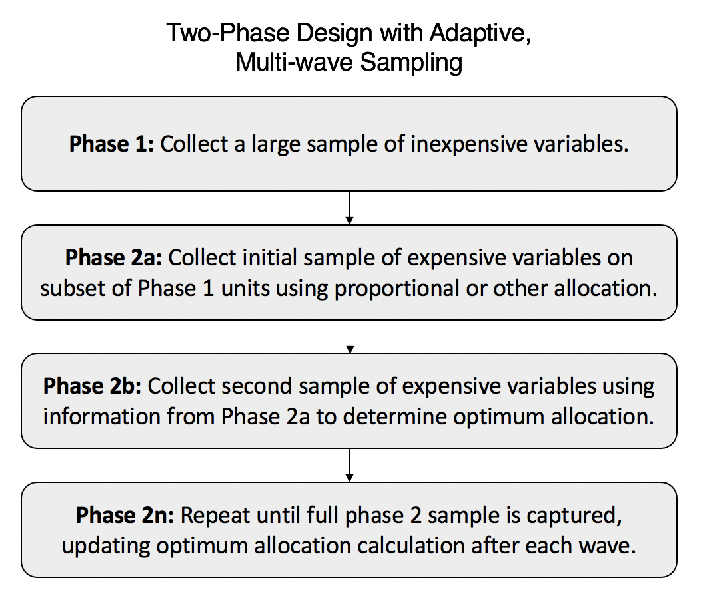
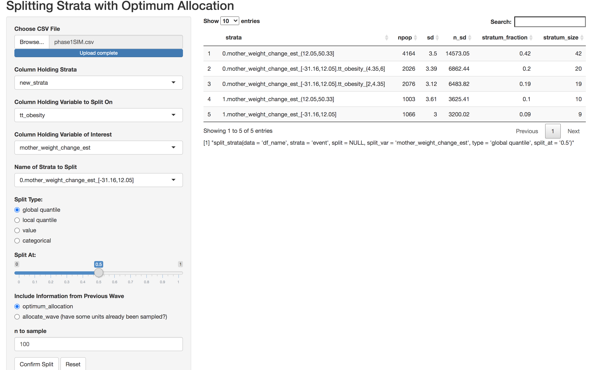

```{r setup, include = FALSE}
knitr::opts_chunk$set(
  collapse = TRUE,
  comment = "#>"
)

library(optimall)
library(DiagrammeR)
library(survey)
library(datasets)
library(dplyr)

data(MatWgt_Sim, package = "optimall")
```


## Introduction

When a study population is composed of heterogeneous subpopulations, stratified random sampling techniques are often employed to obtain more precise estimates of population characteristics. Efficiently allocating samples to strata under this method is a crucial step in the study design, especially when sampling is expensive. 

`optimall` offers a collection of functions that are designed to streamline the process of optimum sample allocation, for a single wave or an adaptive, multi-wave approach. Its main functions allow users to:

* Define, split, and merge strata based on values or percentiles of other variables.

* Calculate the optimum number of samples to allocate to each stratum in a given study in order to minimize the variance of the target sample mean. 

* Select specific IDs to sample based on a stratified sampling design.

* Optimally allocate a fixed number of samples to a sampling wave based on results from a prior wave. 

When used together, these functions can automate most of the sampling workflow. This vignette will outline these package features one by one (moving from simple to more complex), introduce the theoretical framework behind the functions, and finally demonstrate how they can be used collectively to perform multi-wave sampling in R. The final section then details how to use `optimall_shiny()` to efficiently make decisions about splitting strata.

## Defining and Refining Strata

In stratified sampling, strata are typically defined on values or quantiles of inexpensive variables available for the entire population. Given a dataset with one row per sampling unit and at least one column containing a variable that can be used to construct strata, `optimall` allows users to easily define, split, and merge strata.

To demonstrate the simple process of refining strata in `optimall`, we use the `iris` dataset from the R package `datasets`. Suppose that we have defined three strata based on `"Species"`, but we want to split two out of the three, setosa and virginica, in half based on the within-stratum median of `"Sepal.Width"`. In `optimall`, we can do this by calling the `split_strata()` function:

```{r}
library(optimall)
library(datasets)

iris <- datasets::iris
table(iris$Species)
iris2 <- split_strata(data = iris,
                     strata = "Species",
                     split = c("setosa", "virginica"), 
                     split_var = "Sepal.Width",
                     split_at = c(0.5), type = "local quantile")
table(iris2$new_strata)
```

Similarly, we can merge strata using the function `merge_strata()`:

```{r}
iris3 <- merge_strata(data = iris,
                     strata = "Species",
                     merge = c("setosa", "versicolor"), 
                     name = "set_or_vers")
table(iris3$new_strata)
```

The `split_strata` and `merge_strata()` functions are quite versatile. See function documentation for more information.

## Optimum Allocation
Assuming that the per-unit sampling cost is the same in each stratum and that $S_h$, the standard deviation of the variable of interest within each stratum, can be estimated, Neyman (1934) presented the following solution to optimally allocate $n$ samples among $H$ strata in order to minimize the variance of the sample mean:  

$$n_h = n \frac{N_hS_h}{\sum_{i=1}^H N_iS_i}.$$
This formula is known as Neyman allocation and is one of the functions available in `optimall`. Neyman allocation offers the advantage of outputting sampling fractions that can later be multiplied by $n$ or taken on their own if $n$ is not known.  

While Neyman allocation has a strong theoretical backing, Wright (2014) points out some limitations that make it sub-optimal in practice. 

1. Neyman does not require that the solution to $n_h$ is an integer, and thus it rarely is. When taking a fraction of a sample is not practical, researchers are forced to stray from the theory by rounding the sample sizes in ways that are not always optimal. 
2. Closely related to the first issue, the rounded results for $n_h$ are not guaranteed to sum to $n$. This is clearly sub-optimal.

Wright offers alternative algorithms that solve the optimal problem for a discrete allocation that sums exactly to $n$, which can also be implemented in `optimall`. Essentially, his approaches use linear constraints to optimize the allocation of samples over a space of integer values. He makes use of within-stratum variance and population stratum size to generate priority values, which in turn dictate how many samples should be taken from each stratum. To learn more about the specifics of these algorithms, see Wright (2014).

The `optimall` package allows users to select between Neyman allocation, Wright Algorithm I, and Wright Algorithm II in the `method` argument of the `optimum_allocation()` function. The `optimum_allocation()` function defaults to using Wright Algorithm II. This algorithm requires that at least 2 samples are taken from each stratum.  In `optimall`, stratum sampling sizes for both Wright algorithms are also constrained from above at $N_h$, the population stratum size, using the methods for constraints that Wright details in Algorithm III. 

Below is an example of how `optimum_allocation()` could be called to optimally allocate 40 samples among `"Species"` in the `iris` dataset, minimizing the variance of the `"Sepal.Width"` sample mean.

```{r Example 1}
sampling_design <- optimum_allocation(data = iris, strata = "Species", 
                                      y = "Sepal.Width",
                                      nsample = 40, method = "WrightII")
sampling_design
```

If we have a dataframe that holds the $N_h$ and $sd_h$ for each stratum instead of data for each individual unit, we can still use `optimum_allocation()`:

```{r}
iris_summary <- data.frame(strata = unique(iris$Species),
                           size = c(50, 50, 50),
                           sd = c(0.3791, 0.3138, 0.3225))

optimum_allocation(data = iris_summary, strata = "strata",
                   sd_h = "sd", N_h = "size", 
                   nsample = 40, method = "WrightII")
```

## Selecting IDs to Sample

With the number of units to sample per stratum specified in a dataframe, `optimall` can select the IDs of the units to be sampled using simple random sampling within strata with the function `sample_strata()`:

```{r}
iris$id <- 1:150
set.seed(743)

iris <- sample_strata(data = iris, strata = "Species", id = "id",
                               design_data = sampling_design, design_strata = "strata",
                               n_allocated = "stratum_size")
```

The output of `sample_strata()` is the same input dataframe with a new column called `"sample_indicator"` that holds a binary indicator for whether each unit should be sampled in the specified wave:

```{r}
head(iris)
```

From this dataframe, we can easily extract a vector of the ids to sample:

```{r}
ids_to_sample <- iris$id[iris$sample_indicator == 1]
head(ids_to_sample)
length(ids_to_sample)
```

Note that `design_data` is the output of `optimum_allocation()` in this example, but in practice it can be any dataframe that has one row per stratum and one column specifying each stratum's desired sample size. As such, any method of allocating samples to strata can be implemented by `sample_strata()` as long as the design dataframe is specified and simple random sampling within strata is used. 

## Adaptive, Multi-Wave Sampling
When measuring variables of interest is expensive or difficult, it can be advantageous to employ a multi-phase design, where cheaper variables are collected from the entire population and expensive variables are collected from subsamples selected through adaptive, multi-wave sampling. This approach, which is documented in McIsaac and Cook (2015), involves multiple waves of sampling where information from prior waves is used to inform the optimum sampling design of subsequent ones. With the understanding that both Neyman and Wright's optimum allocation methods depend heavily on standard deviation estimates for the variable of interest, the benefit of multi-wave sampling is clear to see. Sample allocations based on prior waves will use updated estimates of nuisance parameters that incorporate data accumulated in the prior sampling waves. The optimal sampling proportion is updated at the end of each wave, and this update guides the sampling of the next wave. As the phase II data accumulate, the necessary within-strata SD estimates, and thus the estimated optimal sampling proportions, are expected to be closer to their true value.

In the design described by McIsaac and Cook, a large phase-I sample is first taken to measure the inexpensive covariates and/or outcome. The results of this phase will define strata which are then sampled non-optimally (through proportional or balanced sampling) for measurement of the expensive variable in phase-IIa. The phase-IIa results are used to estimate the standard deviation required to optimally allocate the next wave of samples. This process is iterated until the desired sample size for the variable of interest is achieved. Below is an outline of the workflow, which is facilitated by `optimall`:
<br />
<br />

<center>

{width=55%}

```{r, fig.align='center', echo=FALSE, include = FALSE, eval=FALSE}
DiagrammeR::grViz("digraph {
  graph [layout = dot, rankdir = TB]
  
  node [shape = rectangle, fixedsize = true, width = 8.5, height = 1.2, fontname = Helvetica, fontsize  = 20]   
  rec1 [label = <<b>Phase-I:</b><br/>A large sample of inexpensive variables, <br/> define strata based on results.>]
  rec2 [label = <<b>Phase-IIa:</b><br/>Initial stratified sample of expensive variable taken without <br/>optimum allocation>]
  rec3 [label = <<b>Phase-IIb:</b><br/>Second sample of expensive variable with optimum allocation <br/> based on Phase-IIa results>]
  rec4 [label = <<b>Phase-IIc - Phase-IIfinal:</b><br/>Combine previous waves of Phase-II together and repeat <br/> sampling with re-calculated optimum allocation until desired total <br/> sample size for expensive variable is reached at Phase-IIfinal>]
  
  # edge definitions with the node IDs
  rec1 -> rec2 -> rec3 -> rec4

  }", 
  height = 250, width = 700)
```

</center>

<br />

`optimall` allows users to input phase-I data and iteratively allocate samples for subsequent waves with the function `allocate_wave()`. This function runs integer-valued `optimum_allocation()` on a dataset according to Wright's Algorithm II, but it takes into account previous sampling waves to determine how the current wave of samples should be allocated. 

For a simple example, suppose that we again want to allocate 40 samples to minimize the variance of `"Sepal.Width"` in the `iris` dataset, but 30 out of the 40 have already been sampled. We assume that the strata are still defined only by `"Species"`, and that 16 of the first 30 samples were taken from the virginica species, 7 from setosa, and 7 from versicolor. Assuming we only have those 30 samples to base our within-stratum standard deviation estimates on, we can allocate the next 10 samples using `allocate_wave()`:

```{r}
# Set up Wave 1
wave1_design <- data.frame(strata = c("setosa",
                                       "virginica",
                                      "versicolor"),
                           stratum_size = c(7, 16, 7))

# Collect Sepal.Width from only the 30 samples
phase1_data <- subset(datasets::iris, select =  -Sepal.Width)

phase1_data$id <- 1:nrow(phase1_data) #Add id column

set.seed(234)
phase1_data <- sample_strata(data = phase1_data, 
                               strata = "Species", id = "id",
                               design_data = wave1_design,
                               design_strata = "strata",
                               n_allocated = "stratum_size")

wave1_ids <- iris$id[phase1_data$sample_indicator == 1]

wave1_sampled_data <- iris[iris$id %in% wave1_ids, c("id","Sepal.Width")]

wave1_data <- merge(phase1_data, wave1_sampled_data, by = "id", 
                    no.dups =  TRUE, all.x = TRUE)

# We have our 30 samples
table(is.na(wave1_data$Sepal.Width), wave1_data$Species)

# Now, allocate the next 10:
wave2_design <- allocate_wave(data = wave1_data,
                              strata = "Species", 
                              y = "Sepal.Width",
                              already_sampled = "sample_indicator",
                              nsample = 10, 
                              detailed = TRUE)

wave2_design
```

Notice that in this case, `"nsample_optimal"` does not match `"nsample_actual"` for every stratum in the outputted design dataframe. This occurred because we *oversampled* from the virginica stratum in wave 1, meaning that the optimum stratum sample size among 40 total samples was smaller than the amount of samples already taken in that group. When oversampling occurs, `allocate_wave()` recalculates the optimum allocation among the non-oversampled strata and uses that result to allocate the specified number of samples as optimally as possible. When no oversampling occurs, `"nsample_optimal"` will match `"nsample_actual"` for every stratum.

Now we can easily get the 10 new ids to sample using the `wave2_design` as the `design_data` in `sample_strata()`. Notice that we do not have to specify `design_strata` or `n_allocated` because the default arguments are the column names of the `allocate_wave()` output:

```{r}
 # Run sample_strata
wave2_data <- sample_strata(data = wave1_data, strata = "Species",
                            id = "id", already_sampled = "sample_indicator",
                            design_data = wave2_design)

 # Extract the 10 ids to sample
wave2_ids <- iris$id[wave2_data$sample_indicator == 1]

wave2_ids
```

## Examples: Using `optimall` to Determine Study Design and Sample Data

#### *Overview*
We use the simulated dataset `MatWgt_Sim` to demonstrate how the functions in `optimall` can be used to carry out study design and sampling tasks in R. This section includes three examples, which build upon eachother during the design and execution of a multi-wave survey:

* Example 1: Uses the function `split_strata()` to define and refine strata.

* Example 2: Uses the function `sample_strata()` to randomly select units to be sampled based on a specified sampling design. 

* Example 3: Demonstrates how to conduct an adaptive, multi-wave sampling design that uses an optimal Neyman allocation scheme at each step to allocate the next wave across strata.

The dataset contains simulated data based on a real study of the association between maternal weight gain during pregnancy and the risk of childhood obesity after controlling for a number of clinical and demographic covariates. In this hypothetical example, the study data are obtained from electronic health records, which are known to be error-prone and do not have all the variables of interested available without manual chart review. In a perfect world, chart review would be used to validate and obtain the necessary variables on every observation in our sample, but chart review is an expensive and difficult task. Researchers determined that they could only reasonably afford to validate 750 out of the 10,335 child-mother pairs. We refer to the 10,335 as the phase 1 sample, for which we have error-prone observations on all, and we refer to the 750 as the phase II sample, which will be designed using tools in the `optimall` package. For simplicity, suppose that we want to use these 750 samples to estimate the true population mean of maternal weight change during pregnancy with minimal variance. This goal will be accomplished in our last example through an adaptive, multi-wave sampling design.

#### *Data Set Up*

The simulated data used in this example is included with `optimall`. The dataset `MatWgt_Sim` contains 10335 rows, one for each mother-child pair, and 6 columns containing ID numbers and covariates which we see below:

```{r first view of data}
data(MatWgt_Sim, package = "optimall")
head(MatWgt_Sim)
```

Three of the covariates, child race, diabetes, and estimated maternal weight, are inexpensive to collect for all subjects, but determining the true maternal weight requires a tedious validation process. This full version of the simulated dataset contains the true weight change for all 10335 mothers, which may or may not have a relationship with the other covariates.

For the purpose of our examples, we suppose that we do not have access to this full dataset. Instead, we must sample from it to optimally estimate the mean of the true maternal weight changes.

During phase-I, we assume that all 10335 mother-child pairs have been sampled for the inexpensive covariates. Accordingly, we define our phase 1 dataset to be 10335 x 5 with every column of the full `MatWgt_Sim` data excluding the expensive true weight change. In the examples that follow, we will assume the validated maternal weight variable `mat_weight_true` will only be available through phase 2 sampling.

```{r}

# Get phase 1 data, remove mat_weight_true which we assume is unknown
phase1 <- subset(MatWgt_Sim, select =  -mat_weight_true)
dim(phase1)
```

#### *Example 1: Defining Sample Strata*

We suspect that the true mean maternal weight change may vary with some of the inexpensive covariates in the phase 1 dataset, so we decide to split our population into 9 non-overlapping strata. Each stratum will be defined by a unique combination of race and global percentile of maternal weight gain (≤25th, 25th - 75th, >75th). We can accomplish this quickly in `optimall` using the `split_strata()` function.

```{r}
phase1$strata <- phase1$race #initialize a strata column first

# Merge the smallest race categories

phase1 <- merge_strata(data = phase1, 
                          strata = "race",
                          merge = c("Other","Asian"),
                          name = "Other")

phase1 <- split_strata(data = phase1, strata = "new_strata", split = NULL, 
                       split_var = "mat_weight_est", 
                       type = "global quantile", 
                       split_at = c(0.25,0.75),
                       trunc = "MWC_est")
# Trunc argument specifies how to refer to mat_weight_est in new strata names
```
We now have the same `phase1` data with a new column specifying the strata we have defined. 

```{r}
head(phase1)
table(phase1$new_strata) # 9 strata
```

#### *Example 2: Create an Initial Phase 2 Subsample: Phase-IIa*
With the strata now defined by the inexpensive variables sampled in phase-I, we are ready to begin auditing patient records for validation of the true maternal weight changes. Without any validated data to define the optimum phase-IIa sample allocation, we decide to use proportional stratified sampling for the first 250 out of our 750 audits. Conveniently, `optimall` can select this random sample for us with `sample_strata()`.

The `sample_strata()` function requires as input two dataframes, one containing the stratum membership of each individual unit (`data`) and a second specifying the sampling design (`design_data`). The `design_data` dataframe must contain at least two columns:

* `design_strata`: A column holding strata names
* `n_allocated`: The total $n$ allocated to each stratum.

In our example, we want the proportion of samples randomly taken from each stratum to reflect its population proportion and a total of 250 samples. 

```{r}
phase2a_design <- data.frame(
  strata_name = names(table(phase1$new_strata)), 
  strata_prop = as.vector(table(phase1$new_strata))/10335,
  strata_n = round(250.3*as.vector(table(phase1$new_strata))/10335)
  ) # 250.3 to make sure 250 samples after rounding
sum(phase2a_design$strata_n) 
phase2a_design
```
We can now call `sample_strata()` to randomly draw the specified number samples from each stratum. It will output the same `phase1` dataframe with an extra column indicating which units should be sampled. We can then extract the ids to sample based on this indicator.

```{r}
phase1 <- sample_strata(data = phase1, strata = "new_strata", 
                        id = "id", design_data = phase2a_design, 
                        design_strata = "strata_name", 
                        n_allocated = "strata_n")
ids_to_sample2a <- phase1[phase1$sample_indicator == 1,"id"]
length(ids_to_sample2a) # 250 ids to sample
```

We submit these 250 ids for validation. Hypothetically, this involves the hard work of trained nurses, but for our example it involves only a few lines of code. 
```{r}
phase2a_samples <- MatWgt_Sim[MatWgt_Sim$id %in% ids_to_sample2a, 
                              c("id","mat_weight_true")]

phase2a <- merge(phase1, phase2a_samples, by = "id",
                 no.dups =  TRUE, all.x = TRUE)
names(phase2a)
table(is.na(phase2a$mat_weight_true)) 
```

We notice that all of the units that were not validated have `NA` values in the new columns. We will use the non-missing validated data to inform optimum allocation in our future sampling waves. 

#### *Example 3: Optimally Allocate 2nd and 3rd Waves of Phase 2 Sample*
In phase-IIa, we allocated samples to strata using proportional sampling rather than optimum allocation because we had no prior samples of the true maternal weight change from which to estimate within-stratum variances. Now that we have completed the first wave of validation, we can estimate these variances and will thus use optimum allocation for each of the subsequent sampling waves.

In phase-IIb (wave 2), we will optimally allocate 250 more samples, raising our total number of validated samples to 500. The `allocate_wave()` function makes this step simple by calculating the optimum allocation for 500 samples, determining how many units have already been sampled in previous waves (only Phase-IIa in this case), and allocating the 250 samples of the current wave to make up the difference. The output is a design dataframe summarizing the results for each stratum.

```{r}
phase2b <- phase2a

# Add indicator for units that were already sampled
phase2b$already_sampled <- ifelse(phase2b$id %in% ids_to_sample2a, 1, 0)

# Make design 
phase2b_design <- allocate_wave(data = phase2b, strata = "new_strata",
                             y = "mat_weight_true",
                             already_sampled = "already_sampled", 
                             nsample = 250,
                             detailed = TRUE)
phase2b_design
```


Looking at the output of `allocate_wave()`, we notice that the optimum sample sizes for the next wave vary greatly between strata, but all are greater than one. Because we set `detailed = TRUE`, we can also see what the optimum allocation for 500 samples would have been ignoring prior wave sizes in the column `"nsample_optimal"`. This column matches `"nsample_actual"` because we did not oversample any strata in phase-IIa.

In other cases when `"n_to_sample"` = 0 for some strata, we may not be so lucky. If the optimum sample size in a stratum is smaller than the amount it was allocated in previous waves (`"nsample_prior"`), we say that that stratum has been oversampled. When oversampling occurs, `allocate_wave()` "closes" the oversampled strata and re-allocates the remaining samples optimally among the open strata. Under these circumstances, the total sampling allocation is no longer optimal, but `optimall` will output the most optimal allocation from the non-oversampled strata for the next wave.

Although we don't see evidence of oversampling, these results suggest that our strata are relatively imbalanced. We decide to split the largest stratum into three similarly-sized strata along mat_weight_est using the `local quantile` option of `split_strata()`.  

```{r}
phase2b <- split_strata(data = phase2b, 
                        split = "White.MWC_est_(9.75,15.06]",
                        strata = "new_strata", 
                        split_var = "mat_weight_est",
                        type = "local quantile", split_at = c(1/3,2/3))
```

With our strata now more balanced in size, we can re-run `allocate_wave()` to make a new design dataframe for `sample_strata()` to use to determine which ids to sample in phase-IIb. 

```{r}
phase2b_design <- allocate_wave(data = phase2b, 
                             strata = "new_strata",
                             y = "mat_weight_true",
                             already_sampled = "already_sampled",
                             nsample = 250)
phase2b_design

# Extract IDs to sample
ids_to_sample2b <- sample_strata(data = phase2b, 
                                 strata = "new_strata", 
                                 id = "id", 
                                 already_sampled = "already_sampled", 
                                 design_data = phase2b_design,
                                 design_strata = "strata", 
                                 n_allocated = "n_to_sample")
ids_to_sample2b <- 
  ids_to_sample2b[ids_to_sample2b$sample_indicator == 1,"id"]
length(ids_to_sample2b)
```

We can now get the validated maternal weight changes for these 250 subjects.

```{r, include=TRUE}
# Take samples from true data
phase2b_samples <- MatWgt_Sim[MatWgt_Sim$id %in% ids_to_sample2b,
                              c("id","mat_weight_true")]

# Merge extracted samples with our data.
# Note we use dplyr's coalesce here to merge sampled mat_weight_true with 
# the mat_weight_true solumn already present in phase2b, but manner of 
# merging of samples may vary from project to project.
# For simpler merges, see 'Multiwave Object' vignette.

phase2b <- merge(phase2b, phase2b_samples, by = "id", 
                 no.dups = TRUE, all.x = TRUE)

library(dplyr)

phase2b$mat_weight_true <- 
  dplyr::coalesce(phase2b$mat_weight_true.x,
                  phase2b$mat_weight_true.y)
phase2b <- subset(phase2b, select = -c(mat_weight_true.x,
                                       mat_weight_true.y))

table(is.na(phase2b$mat_weight_true)) # All are NA besides already sampled.
```

With these results in, we can move onto our final wave.

#### *Phase-IIc*

After auditing the 250 additional samples in Phase-IIb, we only have 250 left to validate until we reach our goal of 750. We will combine what we have learned in the previous waves of phase-II to optimally assign these final 250 samples in phase-IIc. 

Following the same steps as in phase-IIb, we use `allocate_wave()` to find the optimum sample sizes in each stratum based on estimates of the variance using our previous samples. We then determine which ids to sample using `sample_strata()`.

```{r}
phase2c <- phase2b

# Add indicator for units that were already sampled
phase2c$already_sampled <- ifelse(phase2b$id %in% c(ids_to_sample2a,
                                                    ids_to_sample2b), 
                                  1, 0)

# Make Design
phase2c_design <- allocate_wave(data = phase2c, strata = "new_strata",
                             y = "mat_weight_true",
                             already_sampled = "already_sampled", 
                             nsample = 250,
                             detailed = TRUE)
phase2c_design

# Find IDs to sample
ids_to_sample2c <- sample_strata(data = phase2c, 
                                 strata = "new_strata", 
                                 id = "id", 
                                 already_sampled = "already_sampled", 
                                 design_data = phase2c_design,
                                 design_strata = "strata", 
                                 n_allocated = "n_to_sample")
ids_to_sample2c <- 
  ids_to_sample2c[ids_to_sample2c$sample_indicator == 1,"id"]
length(ids_to_sample2c)

# Sample
phase2c_samples <- MatWgt_Sim[MatWgt_Sim$id %in% ids_to_sample2c,
                              c("id","mat_weight_true")]

# Add samples to phase2c dataset
phase2c <- merge(phase2c, phase2c_samples, by = "id", 
                 no.dups = TRUE, all.x = TRUE)
phase2c$mat_weight_true <- 
  dplyr::coalesce(phase2c$mat_weight_true.x,
                  phase2c$mat_weight_true.y)
phase2c <- subset(phase2c, select = -c(mat_weight_true.x,
                                       mat_weight_true.y))
```

We have now validated 750 samples! 

As this example shows, there are quite a few moving parts to keep track of in the multi-wave sampling workflow. When performing a multi-wave sampling design, you may also want to consider using `optimall's` multiwave object to organize and visualize the process. This feature is described in detail in the package vignette titled "The Multiwave Object".

## Splitting Strata Efficiently with `optimall_shiny()`

In many cases, deciding which strata to split and where is a difficult task. `split_strata()` makes this job easier, but it is designed for situations where the strata and split values have already been decided by the user. Running it iteratively to experiment with different splits is possible yet tedious. 

To help users make these difficult decisions, `optimall` includes an R Shiny application that reacts in real time to user selections of splitting parameters. It can be called using `optimall_shiny()`. See the screenshot below:
<center>
<br />
{width=80%}
</center>
<br />
Each time the user updates an input, the parameters of the `split_strata()` function are updated accordingly, and the resulting dataframe showing the optimum allocation of samples among the new strata is displayed. Once the user is satsfied with a set of inputs, they can `confirm` the split and the underlying data will be updated. The code used to perform the split will also be displayed.

Note that the data in the Shiny App has to be loaded in from a file, and it is thus separate from data being used in the `optimall` workflow. This means that the user has to return to their R session to make the changes determined in the Shiny app. The app, however, makes this easy by printing the code to perform all of the confirmed changes, so making them in R is as easy as copying and pasting. You may have to update the `"data"` argument. 

For more information on `optimall_shiny` see the package vignette titled "Splitting Strata with Optimall Shiny".


## References
McIsaac MA, Cook RJ. Adaptive sampling in two‐phase designs: a biomarker study for progression in arthritis. Statistics in Medicine. 2015 Sep 20;34(21):2899-912.

Wright, T. A simple method of exact optimal sample allocation under stratification with any mixed constraint patterns.2014; Statistics, 07.
